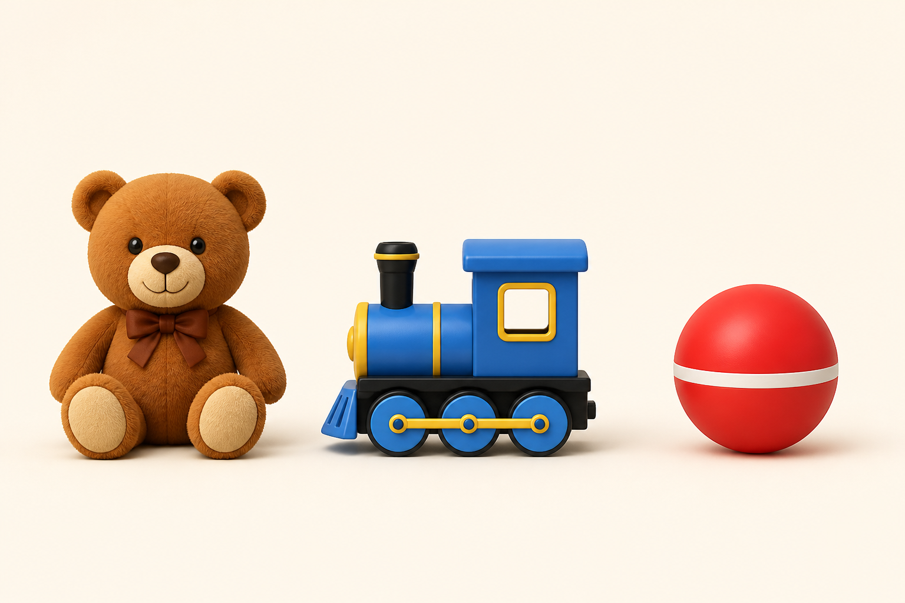
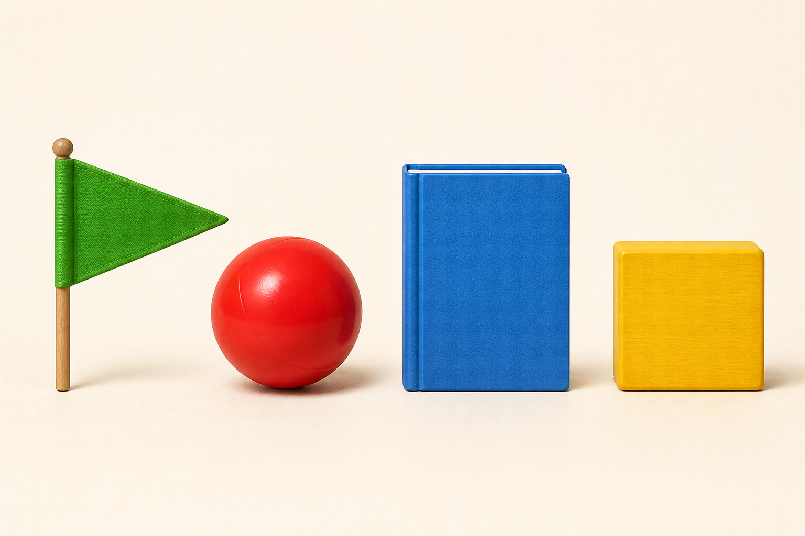
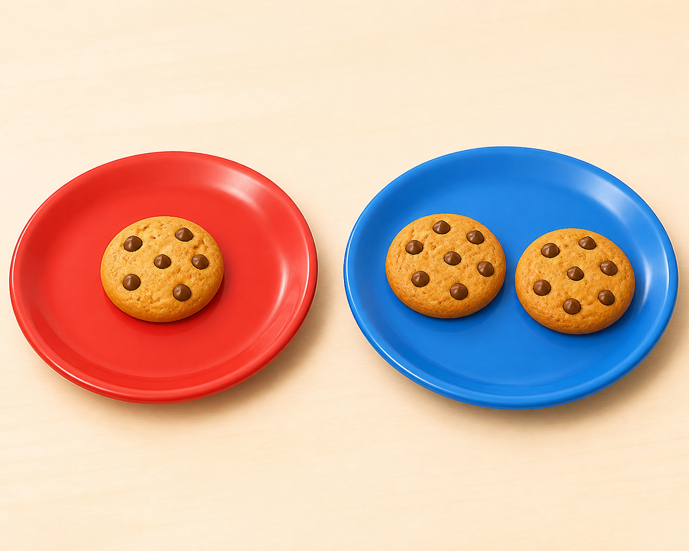
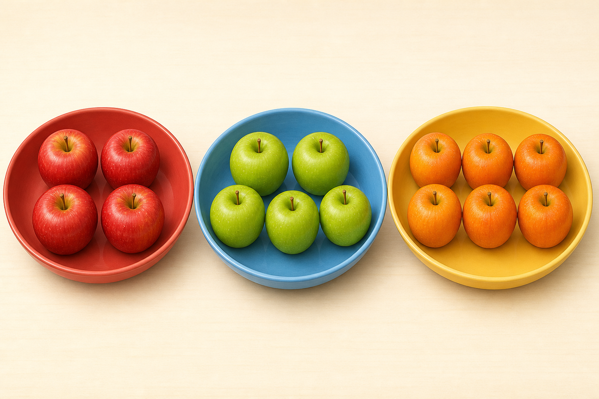

# Lô duyệt 001 — Lớp 1, bài 1–5

Trạng thái: **Chờ người dùng phê duyệt, chưa insert database.**

Mục tiêu của lô này là thêm một câu mức khó tương đối cho mỗi bài. Độ khó nằm ở việc kết hợp hai điều kiện hoặc quan sát nhiều nhóm; câu chữ vẫn ngắn và phù hợp học sinh lớp 1.

## Câu 1

**Đồ chơi nào ở giữa gấu bông và quả bóng?**

A. Gấu bông · B. Tàu hỏa · C. Quả bóng · D. Không có đồ chơi nào  
Đáp án: **B. Tàu hỏa**

## Câu 2

**Đồ vật nào có 4 cạnh nhưng không phải hình vuông?**

A. Lá cờ · B. Quả bóng · C. Quyển sách · D. Miếng gỗ màu vàng  
Đáp án: **C. Quyển sách**

## Câu 3

**Cả hai đĩa có tất cả bao nhiêu chiếc bánh?**

A. 1 · B. 2 · C. 3 · D. 4  
Đáp án: **C. 3 chiếc bánh**

## Câu 4

**Bát nào có nhiều hơn 4 quả táo nhưng ít hơn 6 quả táo?**

A. Bát đỏ · B. Bát xanh · C. Bát vàng · D. Cả ba bát  
Đáp án: **B. Bát xanh**

## Câu 5

**Số nào lớn hơn 7 nhưng bé hơn 9?**

A. 6 · B. 7 · C. 8 · D. 9  
Đáp án: **C. 8**
