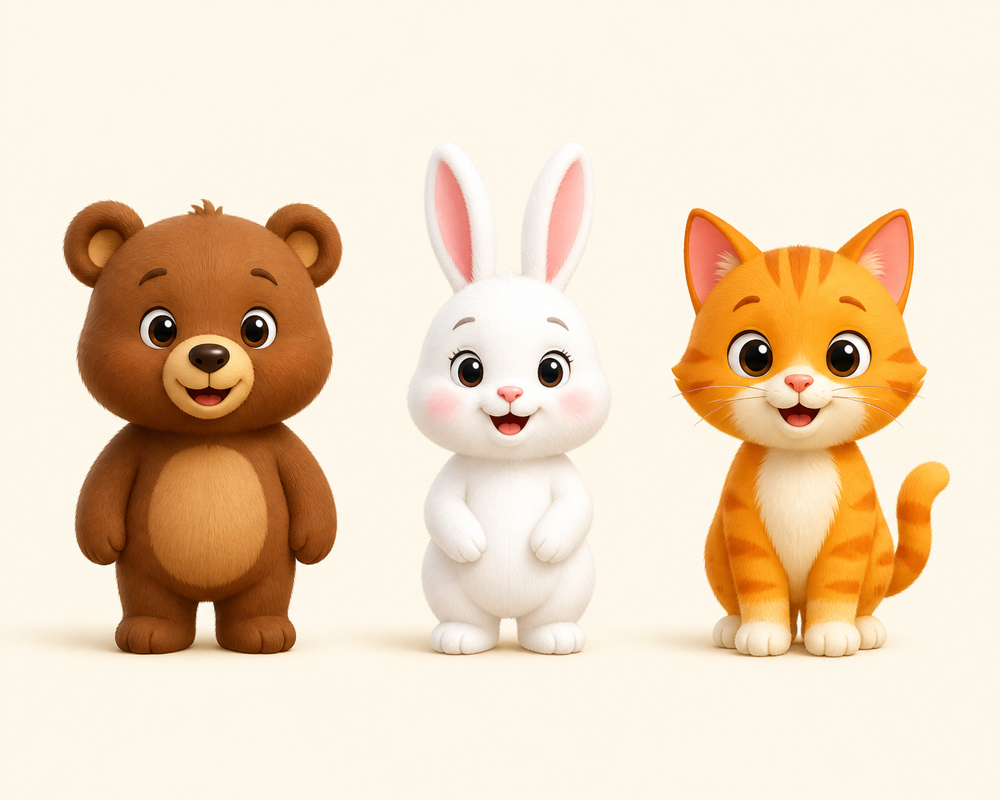
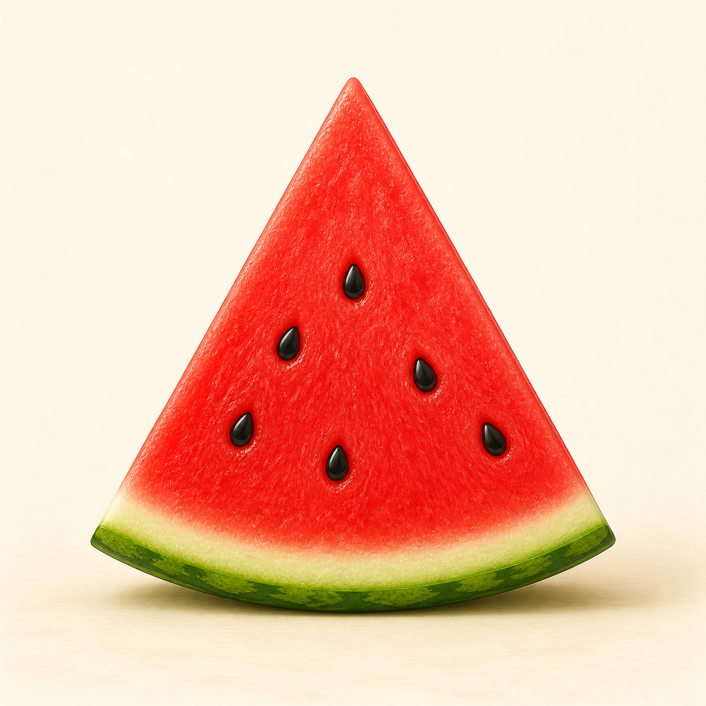
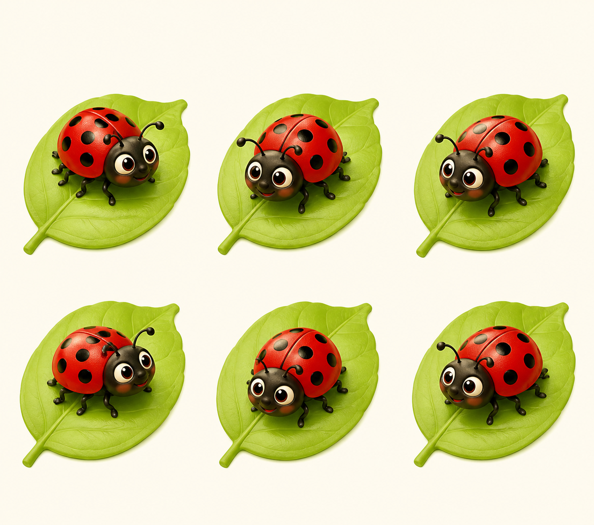

# Lô duyệt 002 - Tự soạn thủ công

Trạng thái: **Chờ người dùng phê duyệt, chưa insert database.**

- Nội dung được viết thủ công từng câu, không dùng script sinh câu hỏi.
- Mỗi câu có một ảnh riêng được tạo bằng công cụ AI tích hợp.
- Phạm vi kiến thức đã đối chiếu SGK Toán 1 Cánh Diều, PDF trang 7-16.

## Câu 1 - Bài 1

**Bạn thỏ đứng ở đâu so với bạn gấu và bạn mèo?**  
A. Ở bên trái · B. Ở giữa · C. Ở bên phải · D. Ở phía sau  
Đáp án: **B. Ở giữa**

## Câu 2 - Bài 2

**Miếng dưa hấu có dạng hình gì?**  
A. Hình vuông · B. Hình tròn · C. Hình tam giác · D. Hình chữ nhật  
Đáp án: **C. Hình tam giác**

## Câu 3 - Bài 3

**Trong hình có bao nhiêu chiếc diều?**  
A. 1 chiếc · B. 2 chiếc · C. 3 chiếc · D. 4 chiếc  
Đáp án: **C. 3 chiếc**

## Câu 4 - Bài 4

**Trong hình có bao nhiêu con bọ rùa?**  
A. 4 con · B. 5 con · C. 6 con · D. 7 con  
Đáp án: **C. 6 con**

## Câu 5 - Bài 5

**Trong hình có bao nhiêu cây bút chì màu?**  
A. 7 cây · B. 8 cây · C. 9 cây · D. 10 cây  
Đáp án: **B. 8 cây**
