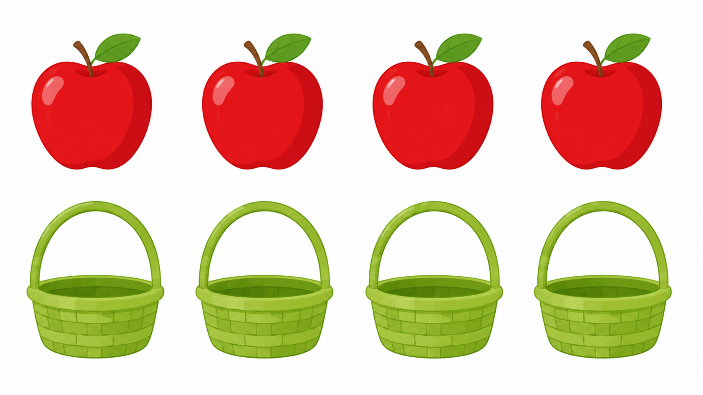
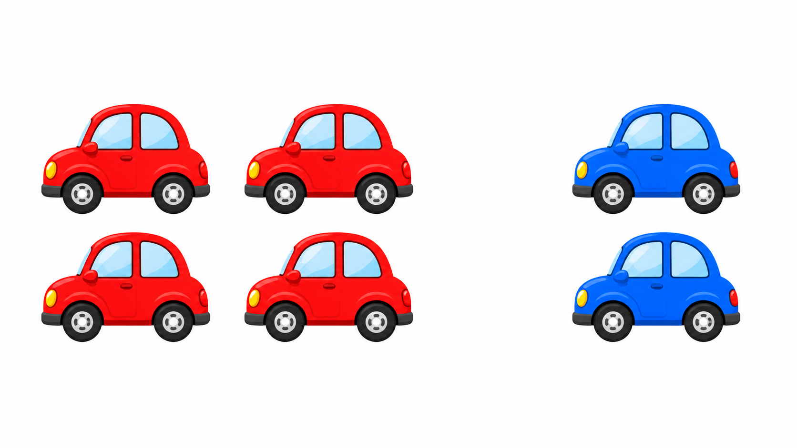
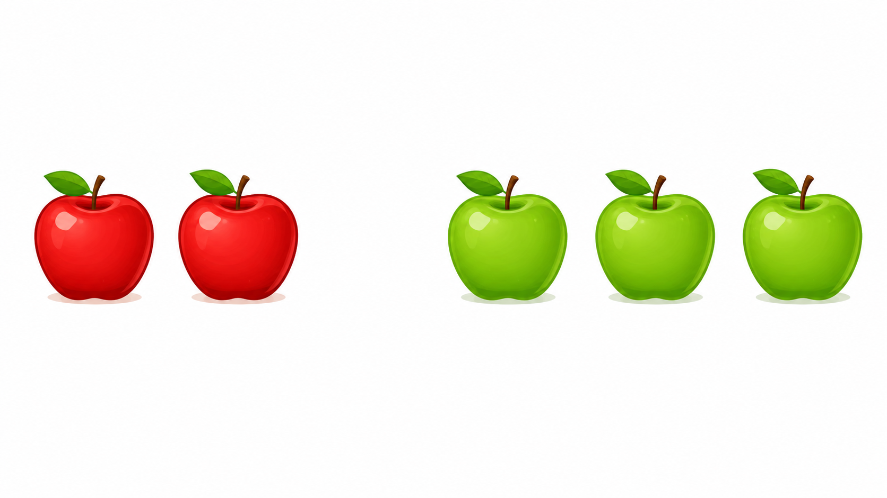

# Lô duyệt 003 — Tự soạn thủ công sau khi đối chiếu SGK

Trạng thái: **Chờ người dùng phê duyệt, chưa insert database.**

- Nội dung được viết thủ công từng câu, không dùng script sinh câu hỏi.
- Mỗi câu dùng một ảnh được tạo bằng một lượt ImageGen riêng.
- Phạm vi đã đối chiếu trực tiếp SGK Toán 1 Cánh Diều tại PDF trang 17–20, 23–26 và 35–36.

## Câu 1 — Bài 6: Số 0

**Trong hộp có bao nhiêu chiếc bánh?**  
A. 0 chiếc · B. 1 chiếc · C. 2 chiếc · D. 3 chiếc  
Đáp án: **A. 0 chiếc**

## Câu 2 — Bài 7: Số 10

**Trong hình có bao nhiêu quả bóng?**  
A. 7 quả · B. 8 quả · C. 9 quả · D. 10 quả  
Đáp án: **D. 10 quả**

## Câu 3 — Bài 8: Nhiều hơn, ít hơn, bằng nhau

**Số quả táo như thế nào so với số chiếc giỏ?**  
A. Nhiều hơn · B. Ít hơn · C. Bằng nhau · D. Không biết  
Đáp án: **C. Bằng nhau**

## Câu 4 — Bài 9: Dấu so sánh

**Bốn chiếc xe đỏ và hai chiếc xe xanh. Cách so sánh nào đúng?**  
A. `4 > 2` · B. `4 < 2` · C. `4 = 2` · D. `2 > 4`  
Đáp án: **A. `4 > 2`**

## Câu 5 — Bài 10: Làm quen với phép cộng

**Gộp hai quả táo đỏ với ba quả táo xanh, ta được phép cộng nào?**  
A. `2 + 3 = 5` · B. `2 + 2 = 4` · C. `3 + 1 = 4` · D. `1 + 3 = 4`  
Đáp án: **A. `2 + 3 = 5`**

## Prompt ảnh đã dùng

Mỗi prompt đều yêu cầu phong cách minh họa phẳng, nền sáng, tỷ lệ ngang 16:9, vật thể lớn và tách rời, không có chữ, số, ký hiệu, câu hỏi, đáp án, logo hoặc watermark. Phần dữ kiện riêng lần lượt là:

1. Một hộp cơm mở hoàn toàn rỗng.
2. Chính xác 10 quả bóng, hai hàng, mỗi hàng 5 quả.
3. Chính xác 4 quả táo và 4 chiếc giỏ, ghép tương ứng một-một.
4. Chính xác 4 xe đỏ ở trái và 2 xe xanh ở phải.
5. Chính xác 2 quả táo đỏ ở trái và 3 quả táo xanh ở phải.
