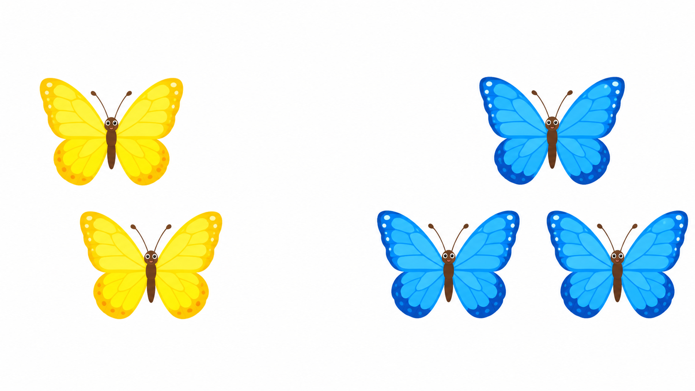
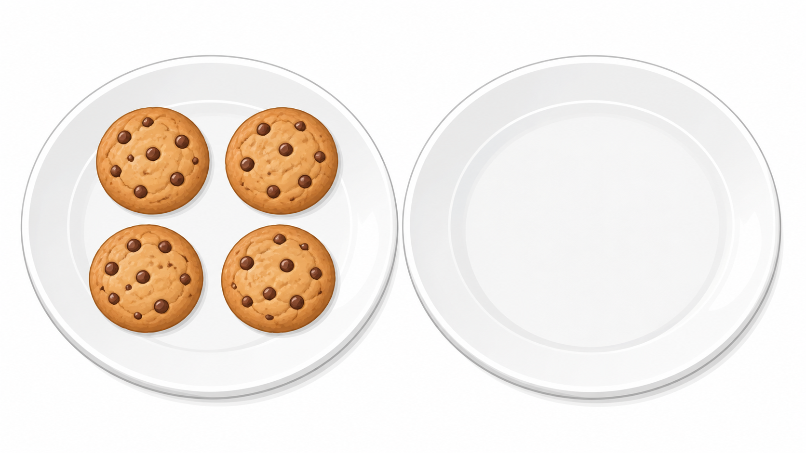
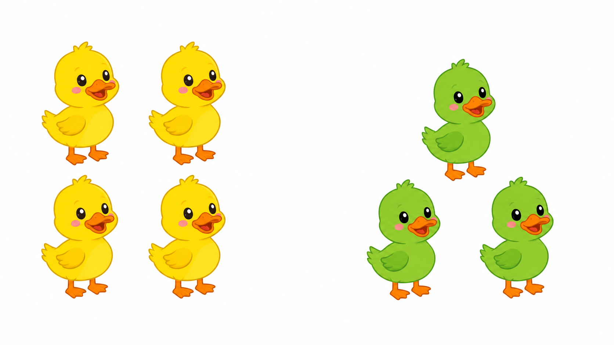
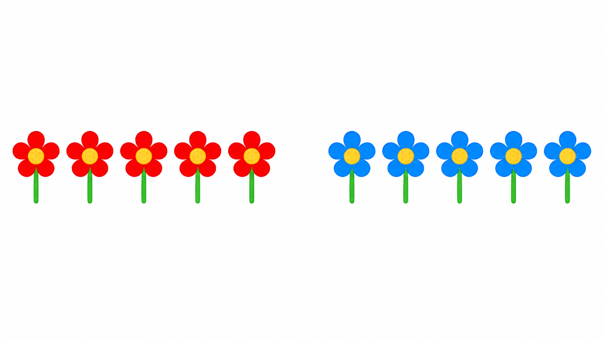

# Lô duyệt 004 — Tự soạn thủ công sau khi đối chiếu SGK

Trạng thái: **Chờ người dùng phê duyệt, chưa insert database.**

- Năm câu được viết thủ công, không dùng script sinh câu hỏi.
- Năm ảnh được tạo bằng năm lượt ImageGen độc lập và đã kiểm tra số lượng trực quan.
- Phạm vi được đối chiếu tại PDF trang 37–42, 45–46 và 49–50 của SGK Toán 1 Cánh Diều.

## Câu 1 — Bài 11

**Hai con bướm vàng bay cùng ba con bướm xanh. Phép tính nào phù hợp?**  
A. `2 + 3 = 5` · B. `2 + 2 = 4` · C. `3 + 3 = 6` · D. `3 + 1 = 4`  
Đáp án: **A. `2 + 3 = 5`**

## Câu 2 — Bài 12

**Có bốn khối lập phương xanh và hai khối lập phương đỏ. Tất cả có bao nhiêu khối lập phương?**  
A. 3 khối · B. 4 khối · C. 5 khối · D. 6 khối  
Đáp án: **D. 6 khối**

## Câu 3 — Bài 13

**Một đĩa có bốn chiếc bánh, đĩa thứ hai không có chiếc bánh nào. Tất cả có bao nhiêu chiếc bánh?**  
A. 0 chiếc · B. 3 chiếc · C. 4 chiếc · D. 5 chiếc  
Đáp án: **C. 4 chiếc**

## Câu 4 — Bài 14

**Nhìn hai nhóm vịt, phép cộng nào cho biết có tất cả bao nhiêu chú vịt?**  
A. `4 + 3 = 7` · B. `4 + 2 = 6` · C. `3 + 3 = 6` · D. `4 + 4 = 8`  
Đáp án: **A. `4 + 3 = 7`**

## Câu 5 — Bài 15

**Năm bông hoa đỏ gộp với năm bông hoa xanh. Kết quả phép cộng là bao nhiêu?**  
A. 7 · B. 8 · C. 9 · D. 10  
Đáp án: **D. 10**

## Prompt ảnh đã dùng

Mỗi prompt yêu cầu ảnh ngang 16:9, phong cách minh họa phẳng, nền sáng, không chữ, số, ký hiệu, câu hỏi, đáp án, logo hoặc watermark. Dữ kiện riêng lần lượt là:

1. Chính xác 2 bướm vàng và 3 bướm xanh.
2. Chính xác 4 khối xanh và 2 khối đỏ.
3. Chính xác 4 chiếc bánh trên một đĩa và 0 chiếc trên đĩa còn lại.
4. Chính xác 4 vịt vàng và 3 vịt xanh.
5. Chính xác 5 hoa đỏ và 5 hoa xanh.
