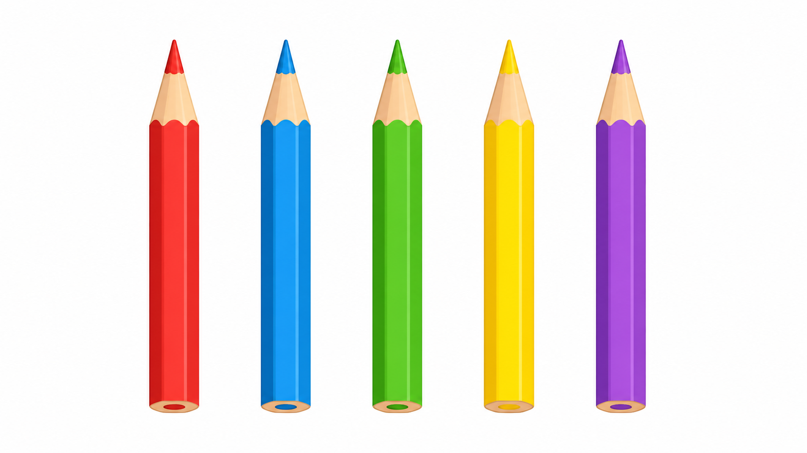

# Lô duyệt 005 — Tự soạn thủ công sau khi đối chiếu SGK

Trạng thái: **Chờ người dùng phê duyệt, chưa insert database, không commit và không push.**

- Năm câu được viết thủ công, không dùng script sinh câu hỏi.
- Năm ảnh được tạo bằng năm lượt ImageGen độc lập và kiểm tra trực quan.
- Phạm vi được đối chiếu tại PDF trang 53–58, 61–62 và 65–66 của SGK Toán 1 Cánh Diều.

## Câu 1 — Bài 16

**Khối màu đỏ trong hình có dạng gì?**  
A. Khối lập phương · B. Khối hộp chữ nhật · C. Hình vuông · D. Hình tròn  
Đáp án: **A. Khối lập phương**

## Câu 2 — Bài 17

**Có năm chú chim, hai chú bay đi. Phép tính nào phù hợp với hình?**  
A. `5 − 2 = 3` · B. `5 − 3 = 2` · C. `3 − 2 = 1` · D. `5 − 1 = 4`  
Đáp án: **A. `5 − 2 = 3`**

## Câu 3 — Bài 18

**Có sáu quả bóng, hai quả bay đi. Còn lại bao nhiêu quả bóng?**  
A. 2 quả · B. 3 quả · C. 4 quả · D. 5 quả  
Đáp án: **C. 4 quả**

## Câu 4 — Bài 19

**Có năm cây bút, không lấy đi cây nào. Còn lại bao nhiêu cây bút?**  
A. 0 cây · B. 4 cây · C. 5 cây · D. 6 cây  
Đáp án: **C. 5 cây**

## Câu 5 — Bài 20

**Có chín viên bi, bốn viên lăn đi. Còn lại bao nhiêu viên bi?**  
A. 3 viên · B. 4 viên · C. 5 viên · D. 6 viên  
Đáp án: **C. 5 viên**

## Prompt ảnh đã dùng

Mỗi prompt yêu cầu ảnh ngang 16:9, phong cách minh họa phẳng, nền sáng, không chữ, số, ký hiệu, câu hỏi, đáp án, logo hoặc watermark. Dữ kiện riêng lần lượt là:

1. Một khối lập phương màu đỏ, nhìn rõ ba mặt.
2. Chính xác 3 chim còn đậu và 2 chim bay đi.
3. Chính xác 4 bóng còn buộc và 2 bóng bay đi.
4. Chính xác 5 cây bút, không có cây nào bị lấy đi.
5. Chính xác 5 viên bi còn lại và 4 viên bi lăn đi.
