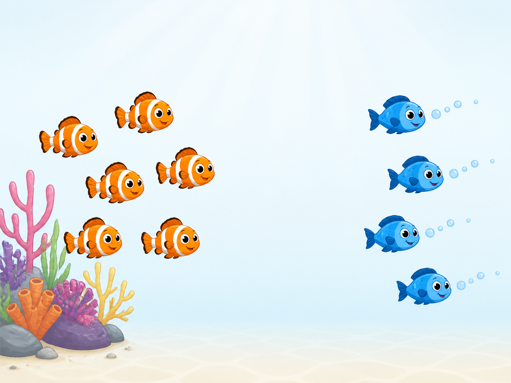
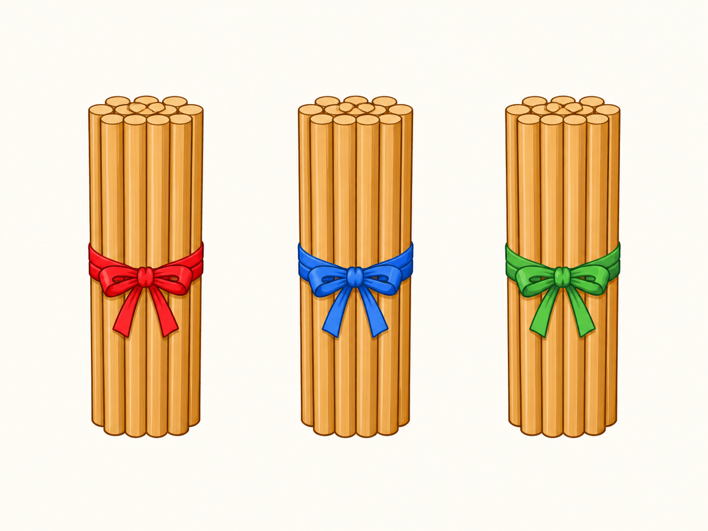
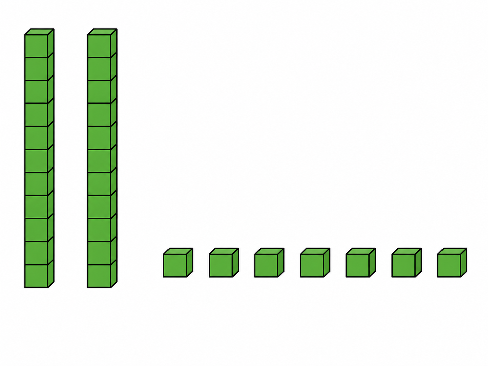
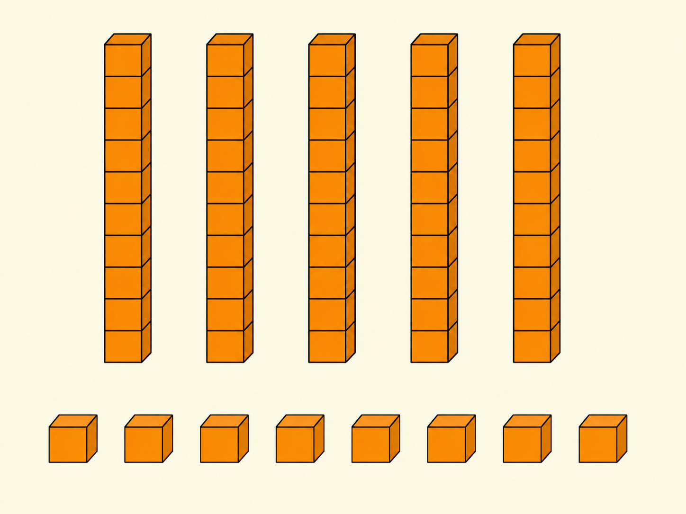
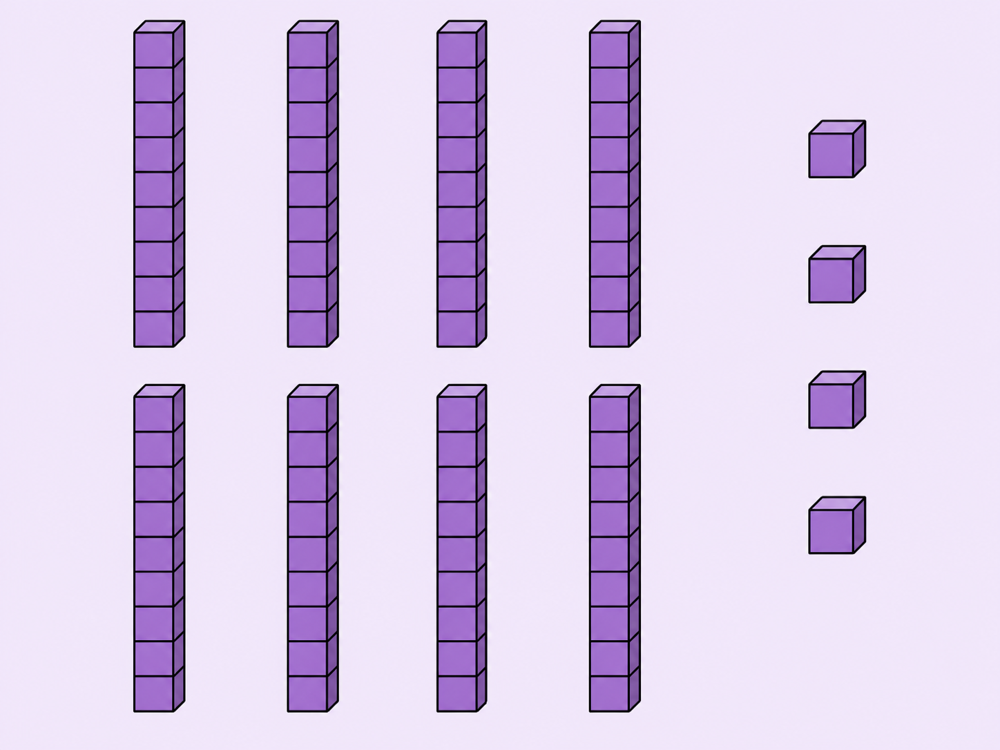

# Lô duyệt 006 — Tự soạn thủ công sau khi đối chiếu SGK

Trạng thái: **Chờ người dùng phê duyệt, chưa insert database, không commit và không push.**

- Năm câu được viết thủ công, không dùng script sinh câu hỏi.
- Năm ảnh được tạo bằng năm lượt ImageGen độc lập và đã kiểm tra trực quan số lượng vật thể.
- Phạm vi được đối chiếu tại PDF trang 69–70 và 87–102 của SGK Toán 1 Cánh Diều.

## Câu 1 — Bài 21

**Có mười con cá, bốn con bơi đi. Còn lại bao nhiêu con cá?**  
A. 4 con · B. 5 con · C. 6 con · D. 7 con  
Đáp án: **C. 6 con**

## Câu 2 — Bài 22

**Hình có tất cả bao nhiêu que tính?**  
A. 13 que · B. 20 que · C. 30 que · D. 40 que  
Đáp án: **C. 30 que**

## Câu 3 — Bài 23

**Các thanh và khối nhỏ trong hình biểu diễn số nào?**  
A. 25 · B. 27 · C. 32 · D. 37  
Đáp án: **B. 27**

## Câu 4 — Bài 24

**Đếm các thanh và khối nhỏ. Em được số nào?**  
A. 48 · B. 50 · C. 58 · D. 68  
Đáp án: **C. 58**

## Câu 5 — Bài 25

**Quan sát các nhóm trong hình. Số thích hợp là số nào?**  
A. 74 · B. 80 · C. 84 · D. 94  
Đáp án: **C. 84**

## Kiểm tra ảnh

1. Câu 1 có đúng 6 cá cam còn lại và 4 cá xanh bơi đi.
2. Câu 2 có đúng 3 bó; mỗi bó thể hiện 10 que và không có que rời.
3. Câu 3 có đúng 2 thanh, mỗi thanh 10 khối, và 7 khối rời.
4. Câu 4 có đúng 5 thanh, mỗi thanh 10 khối, và 8 khối rời.
5. Câu 5 có đúng 8 thanh, mỗi thanh 10 khối, và 4 khối rời.

Tất cả ảnh không chứa câu hỏi, đáp án, chữ, số, phép tính, logo hoặc watermark.
