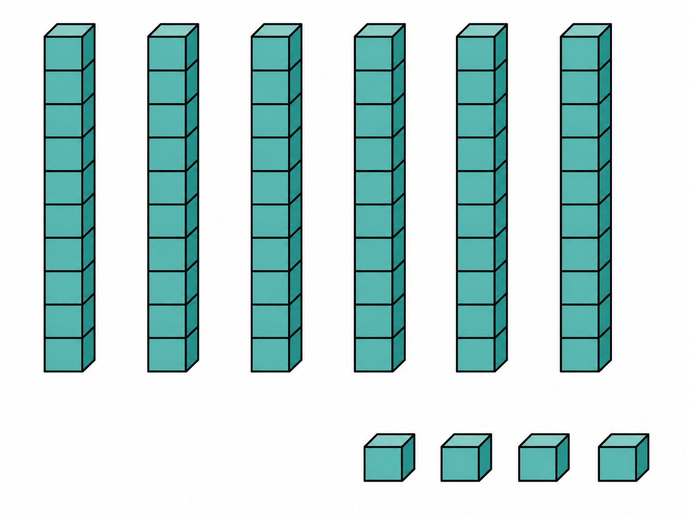
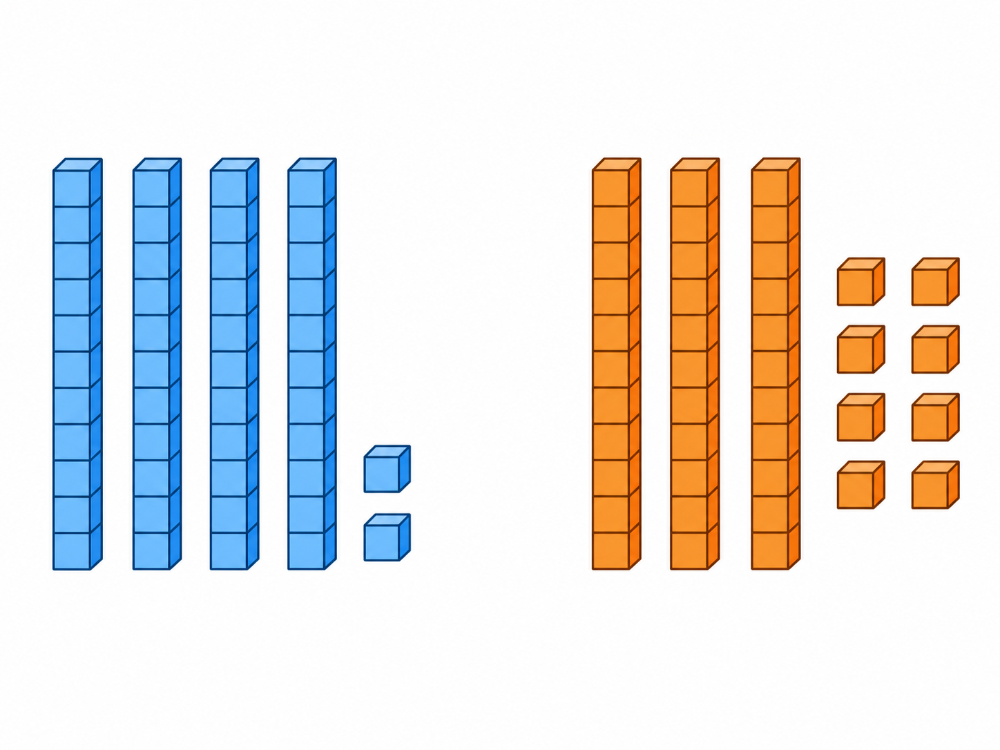
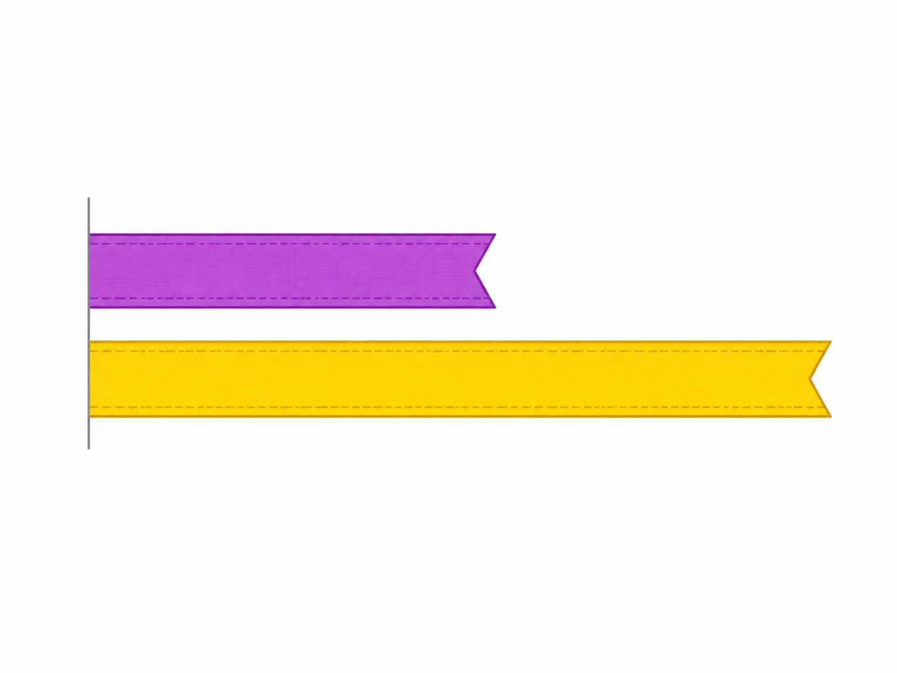
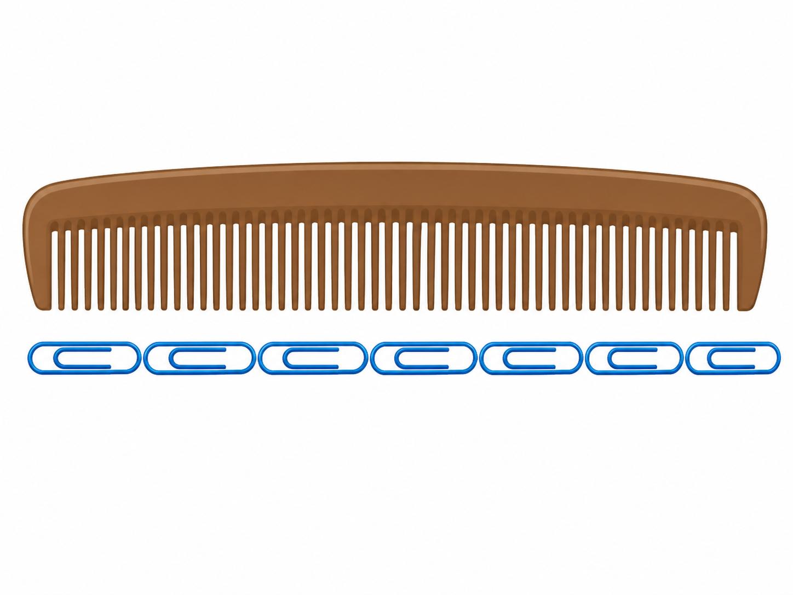
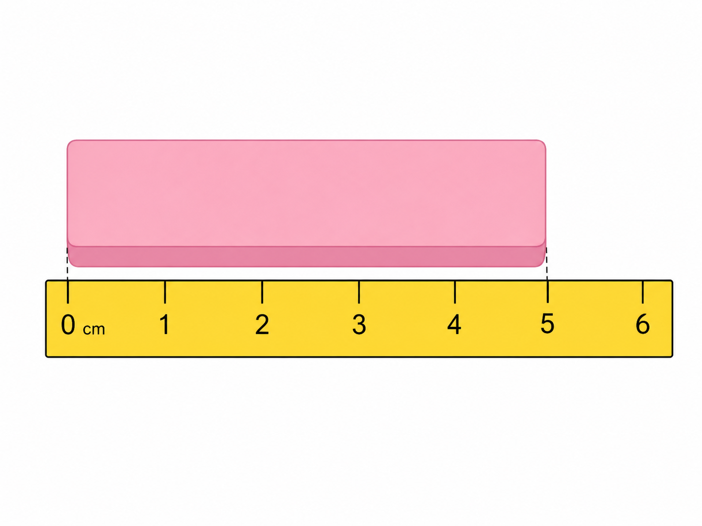

# Lô duyệt 007 — Tự soạn thủ công sau khi đối chiếu SGK

Trạng thái: **Chờ người dùng phê duyệt, chưa insert database, không commit và không push.**

- Năm câu được viết thủ công, không dùng script sinh câu hỏi.
- Năm ảnh được tạo bằng năm lượt ImageGen độc lập và đã kiểm tra trực quan.
- Phạm vi được đối chiếu tại PDF trang 105–119 của SGK Toán 1 Cánh Diều.

## Câu 1 — Bài 26

**Nhìn các khối, hãy chọn cách nói đúng.**  
A. 6 chục và 4 đơn vị · B. 4 chục và 6 đơn vị · C. 6 chục và 0 đơn vị · D. 4 chục và 0 đơn vị  
Đáp án: **A. 6 chục và 4 đơn vị**

## Câu 2 — Bài 27

**Số ở nhóm bên trái thế nào so với số ở nhóm bên phải?**  
A. Lớn hơn · B. Bé hơn · C. Bằng nhau · D. Không so sánh được  
Đáp án: **A. Lớn hơn**

## Câu 3 — Bài 28

**Dải ruy băng màu nào ngắn hơn?**  
A. Dải màu tím · B. Dải màu vàng · C. Hai dải dài bằng nhau · D. Không xác định được  
Đáp án: **A. Dải màu tím**

## Câu 4 — Bài 29

**Chiếc lược dài bằng mấy chiếc kẹp giấy?**  
A. 5 chiếc · B. 6 chiếc · C. 7 chiếc · D. 8 chiếc  
Đáp án: **C. 7 chiếc**

## Câu 5 — Bài 30

**Chiếc tẩy dài bao nhiêu xăng-ti-mét?**  
A. 3 cm · B. 4 cm · C. 5 cm · D. 6 cm  
Đáp án: **C. 5 cm**

## Kiểm tra ảnh

1. Câu 1 có đúng 6 thanh, mỗi thanh 10 khối, và 4 khối rời.
2. Câu 2 có đúng 4 thanh + 2 khối ở trái và 3 thanh + 8 khối ở phải.
3. Câu 3 có đúng hai dải cùng điểm đầu; dải tím kết thúc sớm hơn dải vàng.
4. Câu 4 có đúng một chiếc lược và 7 chiếc kẹp giấy giống nhau xếp nối tiếp.
5. Câu 5 có thước ghi đúng dãy `0, 1, 2, 3, 4, 5, 6`; chiếc tẩy nằm chính xác từ vạch 0 đến vạch 5.

Không ảnh nào chứa câu hỏi, đáp án, logo hoặc watermark. Riêng ảnh đo xăng-ti-mét có các số trên thước và kí hiệu `cm` vì đây là dữ kiện bắt buộc của bài.
