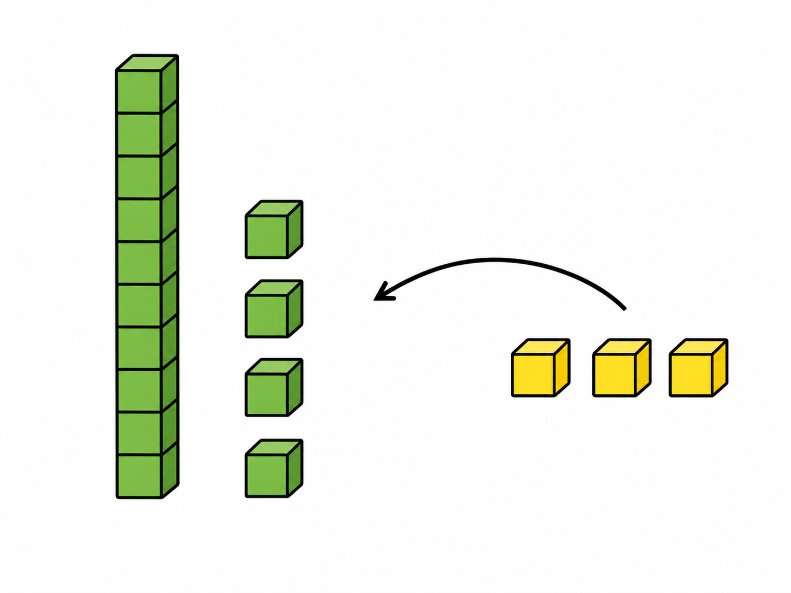
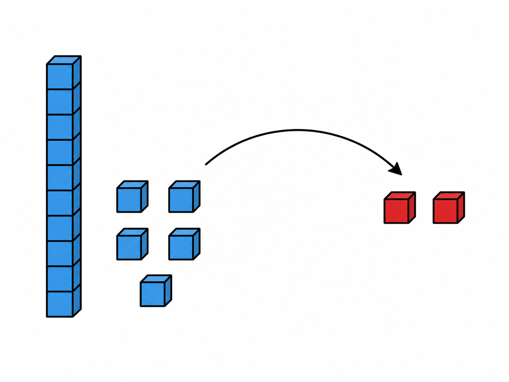
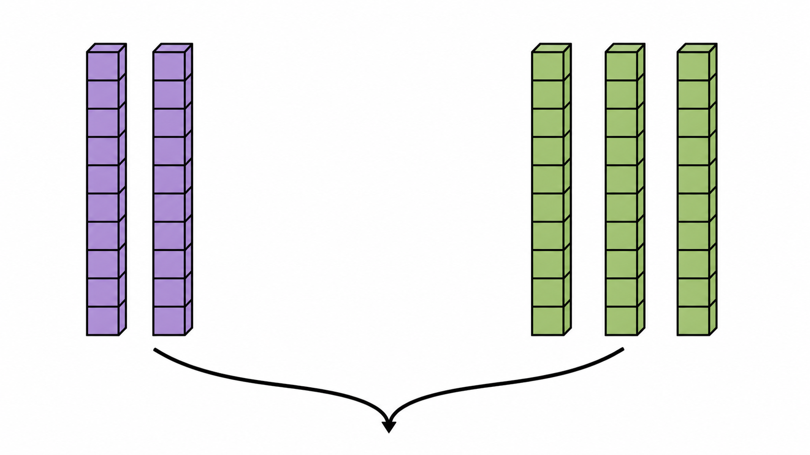
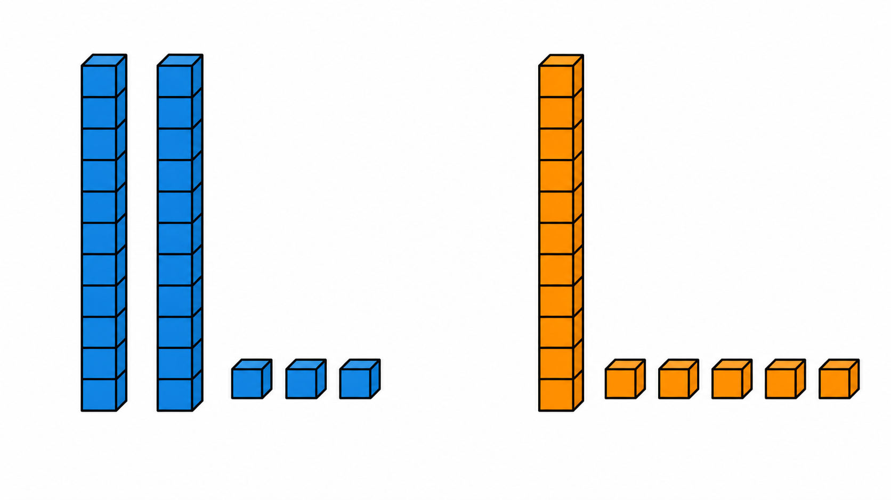
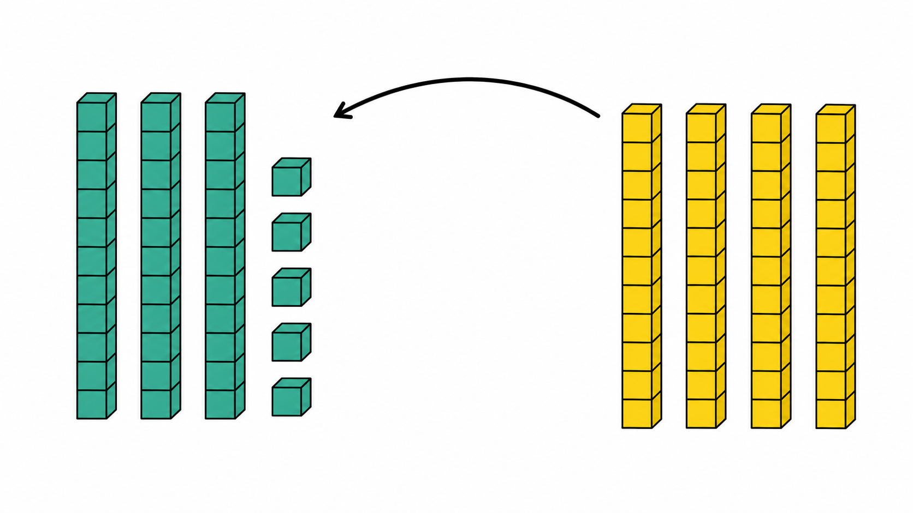

# Lô duyệt 008 — Tự soạn thủ công sau khi đối chiếu SGK

Trạng thái: **Chờ người dùng phê duyệt, chưa insert database, không commit và không push.**

- Năm câu được viết thủ công, không dùng script sinh câu hỏi.
- Năm ảnh được tạo bằng năm lượt ImageGen độc lập và đã kiểm tra trực quan.
- Phạm vi được đối chiếu tại PDF trang 127–138 của SGK Toán 1 Cánh Diều.
- Chỉ sử dụng phép cộng, trừ không nhớ đúng với nội dung của từng bài.

## Câu 1 — Bài 31

**Hình cho thấy 14 khối xanh và thêm 3 khối vàng. Có tất cả bao nhiêu khối?**  
A. 15 khối · B. 16 khối · C. 17 khối · D. 18 khối  
Đáp án: **C. 17 khối**

## Câu 2 — Bài 32

**Có 17 khối, bớt 2 khối. Còn lại bao nhiêu khối?**  
A. 13 khối · B. 14 khối · C. 15 khối · D. 16 khối  
Đáp án: **C. 15 khối**

## Câu 3 — Bài 33

**Hai thanh chục ghép với ba thanh chục được bao nhiêu?**  
A. 30 · B. 40 · C. 50 · D. 60  
Đáp án: **C. 50**

## Câu 4 — Bài 34

**Nhóm bên trái biểu diễn 23, nhóm bên phải biểu diễn 15. Gộp hai nhóm được số nào?**  
A. 28 · B. 35 · C. 38 · D. 48  
Đáp án: **C. 38**

## Câu 5 — Bài 35

**Hình minh họa 35 thêm 40. Kết quả là số nào?**  
A. 39 · B. 65 · C. 75 · D. 85  
Đáp án: **C. 75**

## Kiểm tra ảnh

1. Câu 1 có đúng 1 thanh chục xanh, 4 khối xanh rời và 3 khối vàng được thêm vào.
2. Câu 2 có đúng 1 thanh chục xanh, 5 khối xanh còn lại và 2 khối đỏ được tách ra.
3. Câu 3 có đúng 2 thanh chục tím và 3 thanh chục xanh; không có khối đơn vị.
4. Câu 4 có đúng 2 thanh + 3 khối ở trái và 1 thanh + 5 khối ở phải.
5. Câu 5 có đúng 3 thanh + 5 khối ở trái và 4 thanh ở phải; không có khối vàng rời.

Không ảnh nào chứa câu hỏi, đáp án, chữ, số, logo hoặc watermark.
