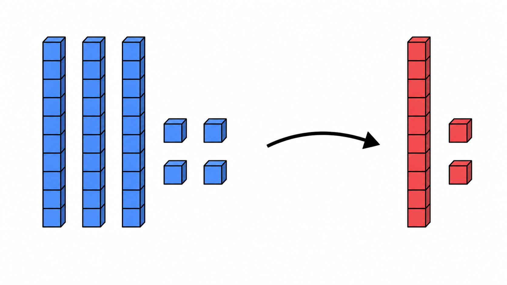
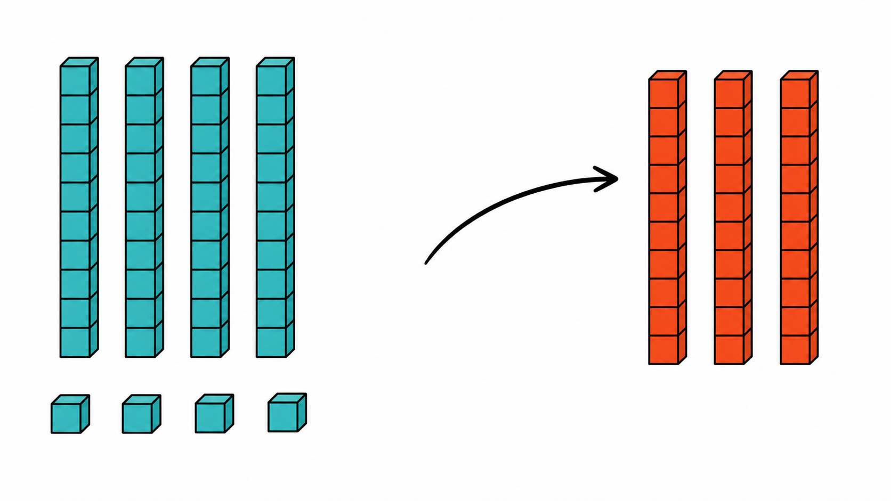
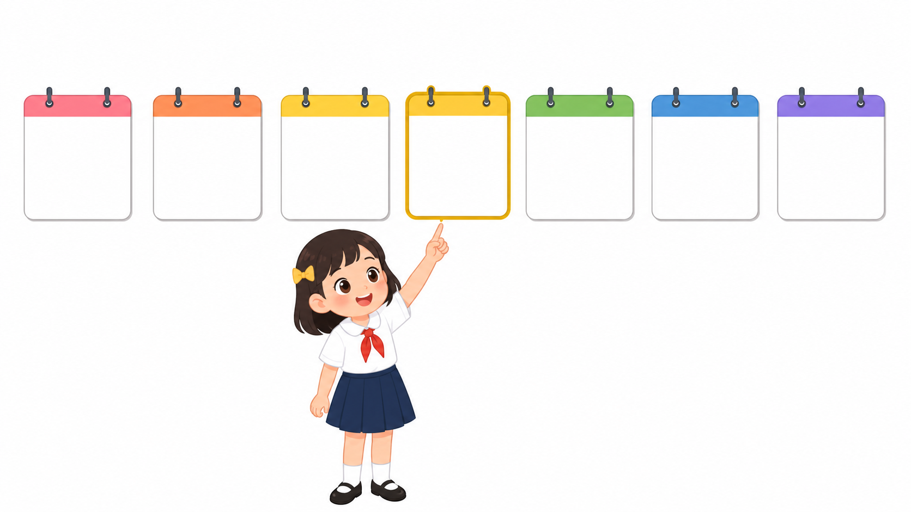
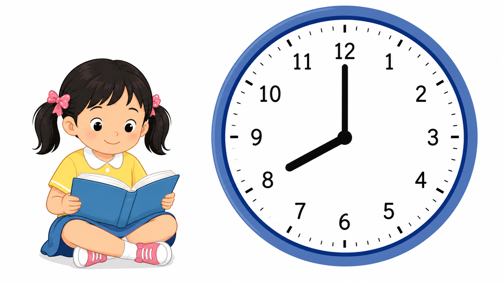

# Lô duyệt 009 — Hoàn tất các bài còn lại của lớp 1

Trạng thái: **Chờ người dùng phê duyệt, chưa insert database, không commit và không push.**

- Bốn câu được viết thủ công, không dùng script sinh câu hỏi.
- Bốn ảnh được tạo bằng bốn lượt ImageGen độc lập và đã kiểm tra trực quan.
- Phạm vi được đối chiếu tại PDF trang 141–144 và 149–153 của SGK Toán 1 Cánh Diều.
- Bài ID 39 là bài cuối lớp 1; ID 40 đã thuộc lớp 2 nên không được ghép vào lô này.

## Câu 1 — Bài 36

**Có 46 khối, bớt 12 khối. Còn lại bao nhiêu khối?**  
A. 24 khối · B. 32 khối · C. 34 khối · D. 44 khối  
Đáp án: **C. 34 khối**

## Câu 2 — Bài 37

**Từ 74, lấy đi 3 chục. Số còn lại là bao nhiêu?**  
A. 41 · B. 44 · C. 47 · D. 71  
Đáp án: **B. 44**

## Câu 3 — Bài 38

**Hôm nay là thứ Tư. Ngày mai là thứ mấy?**  
A. Thứ Ba · B. Thứ Năm · C. Thứ Sáu · D. Chủ nhật  
Đáp án: **B. Thứ Năm**

## Câu 4 — Bài 39

**Mai bắt đầu đọc sách vào thời điểm được vẽ trên đồng hồ. Mai bắt đầu đọc sách lúc mấy giờ?**  
A. 7 giờ · B. 8 giờ · C. 9 giờ · D. 10 giờ  
Đáp án: **B. 8 giờ**

## Kiểm tra ảnh

1. Câu 1 có đúng 3 thanh chục và 4 khối xanh còn lại; đúng 1 thanh chục và 2 khối đỏ được tách ra.
2. Câu 2 có đúng 4 thanh chục và 4 khối xanh còn lại; đúng 3 thanh chục đỏ, không có khối đỏ rời.
3. Câu 3 có đúng 7 tờ lịch trắng xếp liên tiếp; tờ thứ tư được viền vàng và bạn nhỏ chỉ vào tờ này.
4. Câu 4 có đúng một đồng hồ, đủ các số từ 1 đến 12; kim dài chỉ 12 và kim ngắn chỉ 8.

Không ảnh nào chứa câu hỏi, đáp án, logo hoặc watermark. Ảnh đồng hồ có các số từ 1 đến 12 vì đó là dữ kiện bắt buộc để học sinh lớp 1 đọc giờ.
