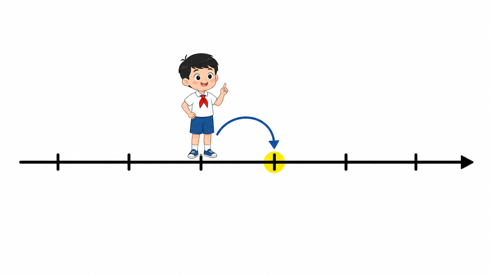
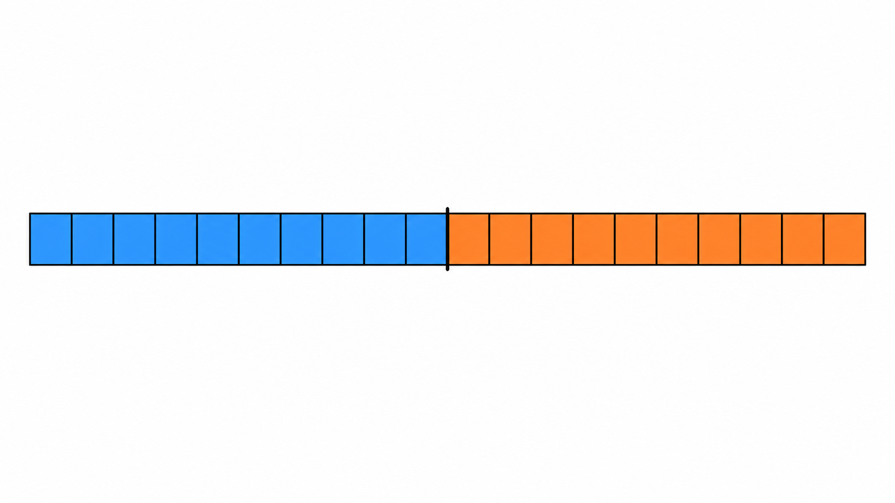
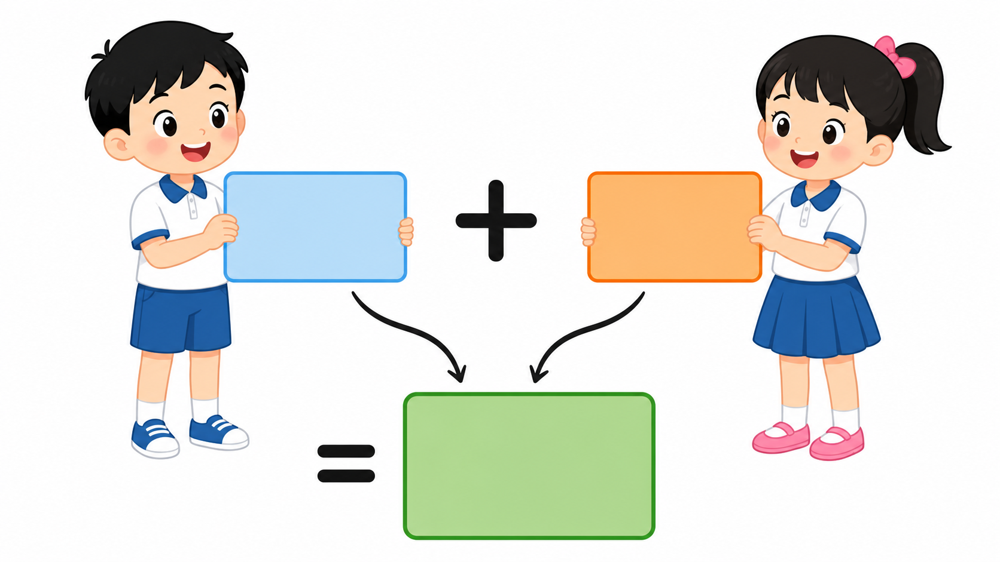
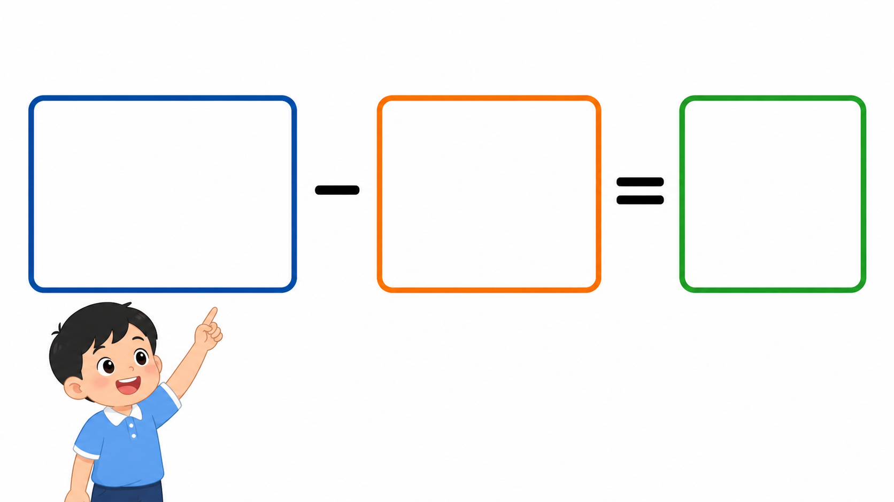
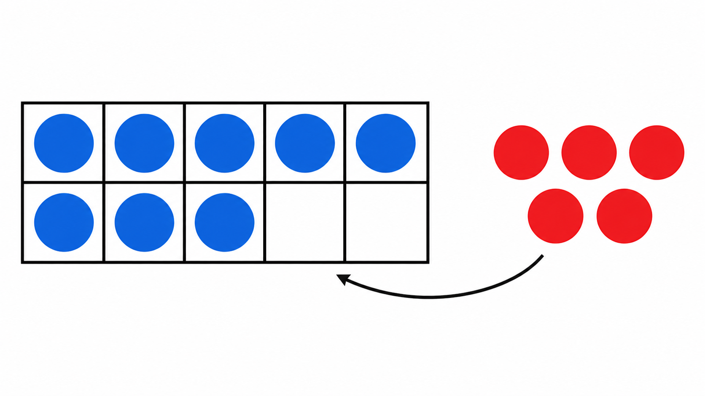

# Lô duyệt 010 — Năm bài đầu theo ID của lớp 2

Trạng thái: **Chờ người dùng phê duyệt, chưa insert database, không commit và không push.**

- Năm câu được viết thủ công, không dùng script sinh câu hỏi.
- Năm ảnh được tạo bằng năm lượt ImageGen độc lập và đã kiểm tra trực quan.
- Phạm vi được đối chiếu tại PDF trang 11–16 và 19–20 của SGK Toán 2 Tập 1 Cánh Diều.

## Câu 1 — Bài 40

**Từ 47 tiến thêm một đơn vị trên tia số, em đến số nào?**  
A. 46 · B. 47 · C. 48 · D. 49  
Đáp án: **C. 48**

## Câu 2 — Bài 41

**Một đoạn dây dài 2 dm. Độ dài đó bằng bao nhiêu xăng-ti-mét?**  
A. 2 cm · B. 10 cm · C. 20 cm · D. 200 cm  
Đáp án: **C. 20 cm**

## Câu 3 — Bài 42

**Trong phép cộng 26 + 13 = 39, số 13 được gọi là gì?**  
A. Số hạng · B. Tổng · C. Dấu cộng · D. Kết quả của phép trừ  
Đáp án: **A. Số hạng**

## Câu 4 — Bài 43

**Trong phép trừ 68 − 24 = 44, số 68 được gọi là gì?**  
A. Số bị trừ · B. Số trừ · C. Hiệu · D. Tổng  
Đáp án: **A. Số bị trừ**

## Câu 5 — Bài 44

**Một khung có 8 hạt xanh, đặt thêm 5 hạt đỏ. Có tất cả bao nhiêu hạt?**  
A. 11 hạt · B. 12 hạt · C. 13 hạt · D. 14 hạt  
Đáp án: **C. 13 hạt**

## Kiểm tra ảnh

1. Câu 1 có đúng 6 vạch trên tia số; bạn nhỏ đứng ở vạch thứ ba và mũi tên đến ngay vạch thứ tư.
2. Câu 2 có đúng 2 đoạn dây nối tiếp; mỗi đoạn chia đúng 10 phần, tổng cộng 20 phần.
3. Câu 3 có đúng 2 thẻ số hạng trống, một dấu cộng và một thẻ kết quả trống.
4. Câu 4 có đúng 3 thẻ trống theo thứ tự phép trừ; bạn nhỏ chỉ vào thẻ đầu tiên.
5. Câu 5 có đúng 10 ô, 8 hạt xanh, 2 ô trống và 5 hạt đỏ bên ngoài.

Không ảnh nào chứa câu hỏi, đáp án, chữ, số, logo hoặc watermark. Các dấu toán trong câu 3–4 là thành phần minh họa bắt buộc của cấu trúc phép tính.
