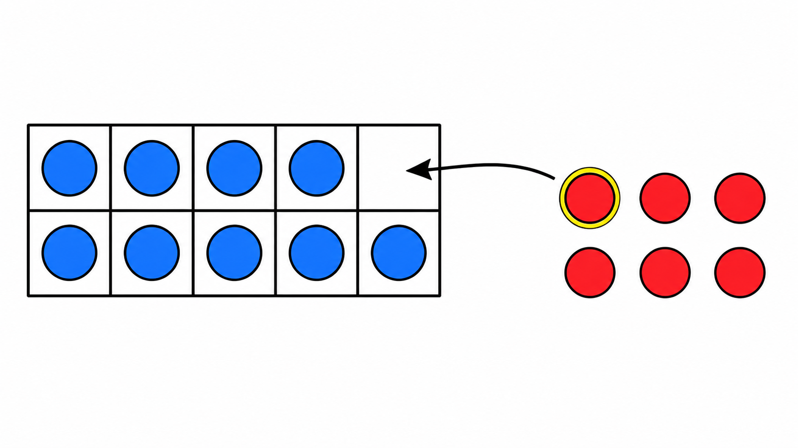
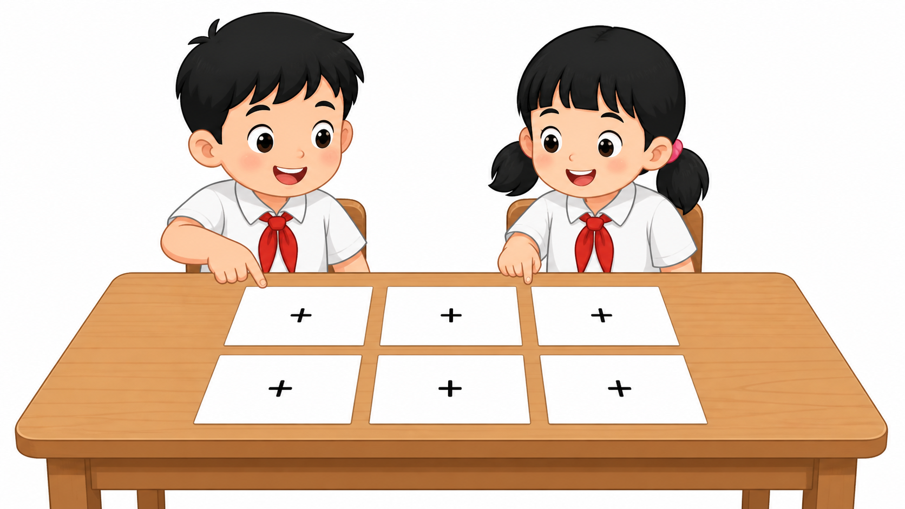
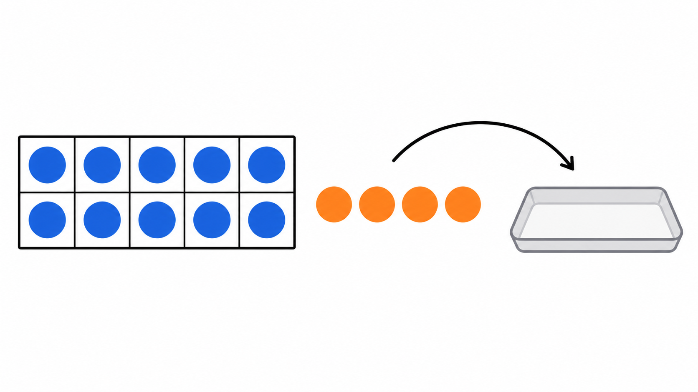
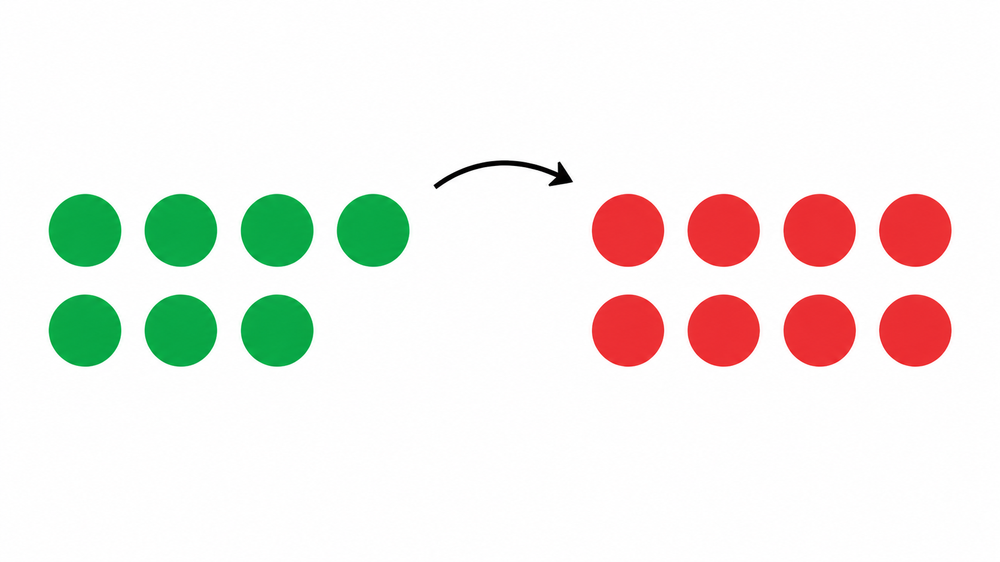

# Lô duyệt 011 — Bài ID 45–49 lớp 2

Trạng thái: **Chờ người dùng phê duyệt, chưa insert database, không commit và không push.**

- Năm câu được viết thủ công, không dùng script sinh câu hỏi.
- Năm ảnh cuối cùng được tạo độc lập bằng ImageGen và đã kiểm tra trực quan.
- Một bản nháp ảnh câu 2 bị loại vì có 8 thẻ thay vì 6; ảnh được dùng bên dưới là bản tạo lại có đúng 6 thẻ.
- Phạm vi được đối chiếu tại PDF trang 21–22, 25–26, 31–34 và 37–38 của SGK Toán 2 Tập 1 Cánh Diều.

## Câu 1 — Bài 45

**Khi tính 9 + 6 bằng cách làm tròn 10, cần lấy mấy đơn vị từ 6 để ghép với 9?**  
A. 1 đơn vị · B. 2 đơn vị · C. 3 đơn vị · D. 4 đơn vị  
Đáp án: **A. 1 đơn vị**

## Câu 2 — Bài 46

**Trong bảng cộng, phép tính nào có kết quả bằng 16?**  
A. 7 + 8 · B. 7 + 9 · C. 8 + 9 · D. 6 + 8  
Đáp án: **B. 7 + 9**

## Câu 3 — Bài 47

**Có 13 chiếc huy hiệu, 5 chiếc đã được phát. Còn lại bao nhiêu chiếc huy hiệu?**  
A. 7 chiếc · B. 8 chiếc · C. 9 chiếc · D. 10 chiếc  
Đáp án: **B. 8 chiếc**

## Câu 4 — Bài 48

**Để tính 14 − 6 bằng cách đưa về 10, trước hết cần bớt mấy đơn vị khỏi 14?**  
A. 2 đơn vị · B. 3 đơn vị · C. 4 đơn vị · D. 6 đơn vị  
Đáp án: **C. 4 đơn vị**

## Câu 5 — Bài 49

**Số nào cần điền vào ô trống để có 15 − □ = 7?**  
A. 6 · B. 7 · C. 8 · D. 9  
Đáp án: **C. 8**

## Kiểm tra ảnh

1. Câu 1 có đúng 10 ô, 9 hạt xanh, 1 ô trống và 6 hạt đỏ; đúng một hạt đỏ được viền vàng.
2. Câu 2 có đúng 2 học sinh và 6 thẻ tổng cộng, xếp thành 2 hàng, mỗi hàng 3 thẻ.
3. Câu 3 có đúng 8 huy hiệu xanh và 5 huy hiệu đỏ, tổng cộng 13 huy hiệu.
4. Câu 4 có đúng 10 hạt xanh trong khung và 4 hạt cam bên ngoài được chuyển sang khay.
5. Câu 5 có đúng 7 hạt xanh và 8 hạt đỏ, tổng cộng 15 hạt.

Không ảnh nào chứa câu hỏi, đáp án, chữ, số, logo hoặc watermark. Các dấu cộng trên thẻ câu 2 chỉ minh họa cấu trúc bảng cộng.
